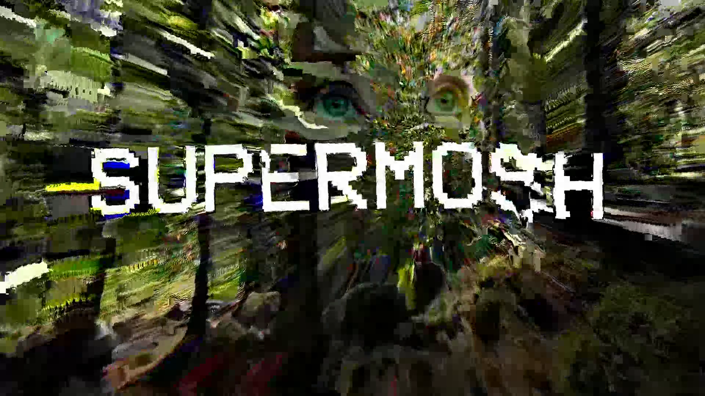

# Supermosh

An experiment to enable datamoshing in the browser

Try it out! [supermosh.github.io](https://supermosh.github.io/)

This repository contains the [core library](./core) and [the source behind the website](./www). Docs related to the core lib are coming!

By Nino Filiu - [ninofiliu.com](https://ninofiliu.com) / [github.com/ninofiliu](https://github.com/ninofiliu/) / [twitter.com/ninofiliu](https://twitter.com/ninofiliu) / [instagram.com/ssttaacckkyy](https://www.instagram.com/ssttaacckkyy/)
